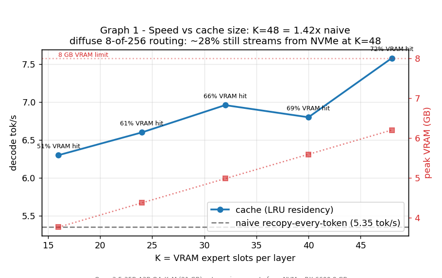
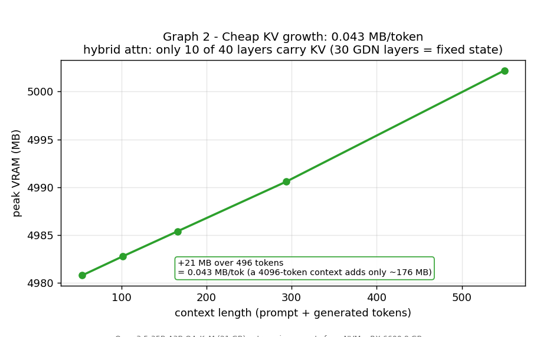
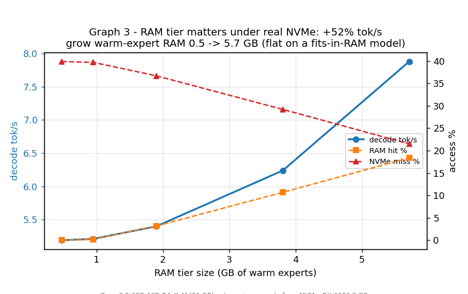
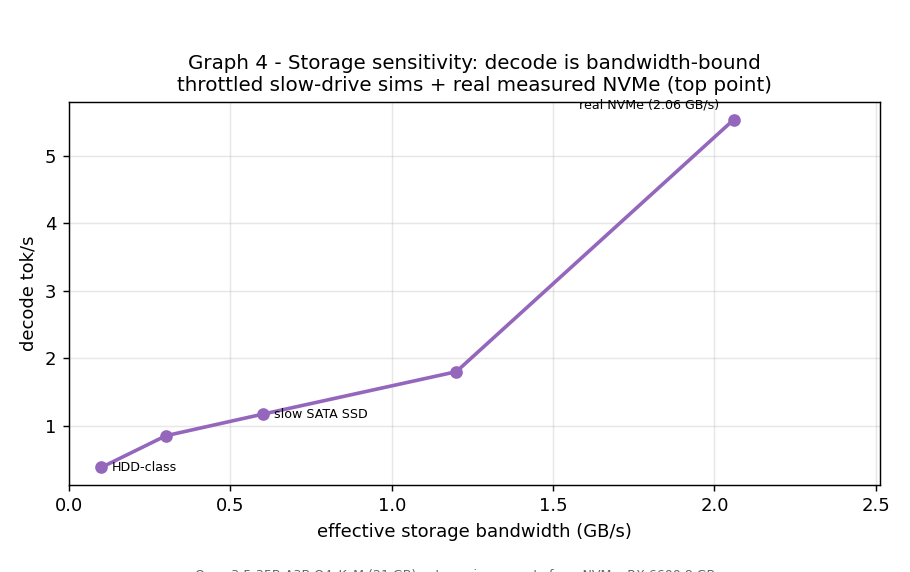
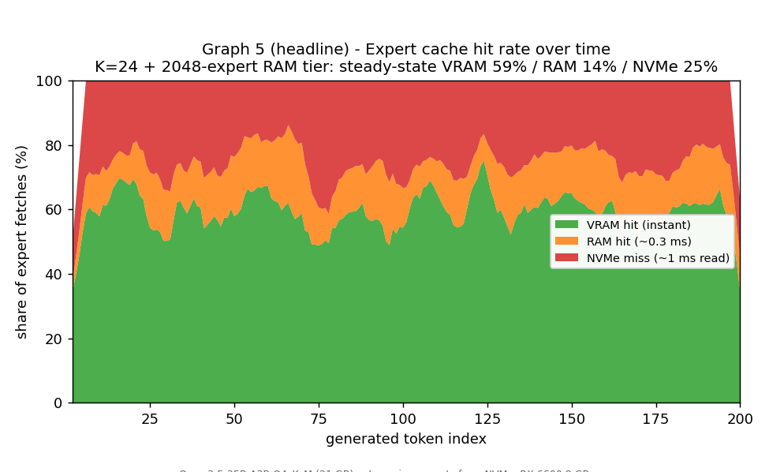
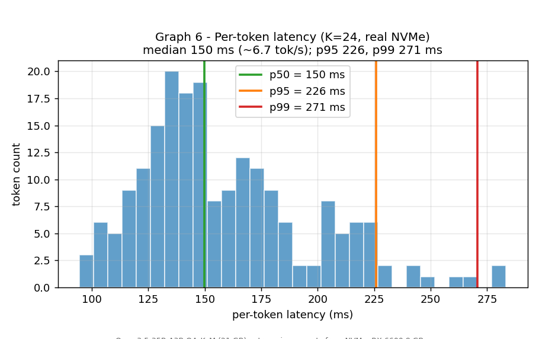
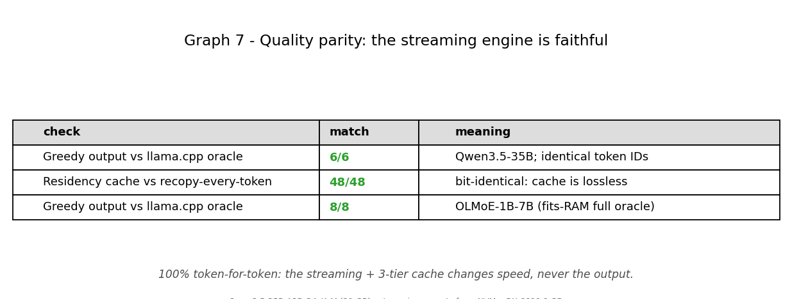
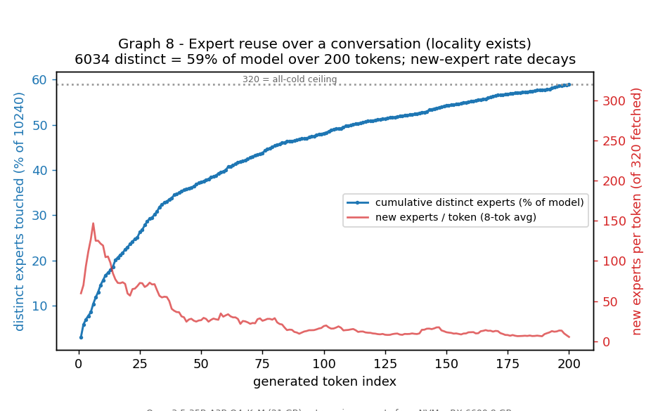

# Streaming-MoE engine — benchmark results

**Model under test:** Qwen3.5-35B-A3B Q4_K_M (`models/qwen3.5-35b-a3b-q4_k_m.gguf`, **21 GB**,
hybrid linear-attention MoE: 40 layers = 30 Gated-DeltaNet linear + 10 full-attention, 256 experts/layer
top-8 + shared expert, ~1.86 MB/expert).
**Hardware:** AMD RX 6600 (8 GB VRAM, Vulkan), 16 GB system RAM, Samsung 970 EVO Plus NVMe.

Because the model (21 GB) is **larger than system RAM (16 GB)**, experts genuinely stream from NVMe on
demand — there is no page-cache shortcut. Every number below is the real too-big-for-RAM operating regime
the engine was built for. The engine keeps only the ~non-expert weights resident in VRAM and streams the
top-8 experts/layer through a 3-tier cache (VRAM slots → bounded RAM tier → NVMe) each token.

All figures in [bench/figs/](../bench/figs/). Raw data in [bench/results/qwen/](../bench/results/qwen/).
Reproduce: `powershell -File bench\run_bench_qwen.ps1 -Which all` then `py bench\plot.py`.

---

## The eight graphs

### 1. Tokens/sec vs K expert slots — *speed/cache tradeoff*

Naive (recopy 8 experts every token) = **5.35 tok/s**. Cache K=16→48 = **6.3 → 7.58 tok/s** as the
VRAM expert hit rate climbs 51% → 72%; peak VRAM grows 3.8 → 6.2 GB (K=48 ≈ the 8 GB ceiling).
K=48 is **1.42× naive** — a deliberately *modest* speedup: with diffuse 8-of-256 routing, ~25–28% of
fetches still miss to NVMe even at the largest cache, so the drive is the floor, not the cache. (The K=40
dip is honest run-to-run NVMe variance.)

### 2. VRAM use vs context length — *cheap KV growth*

Peak VRAM grows **0.043 MB/token** (context 54 → 550 added only 21 MB). This is the hybrid-architecture
payoff: only the **10 full-attention layers carry a KV cache**; the 30 Gated-DeltaNet layers use a
fixed-size recurrent state independent of context. A 4096-token context costs ~176 MB of KV — negligible
against the 21 GB model.

### 3. Tokens/sec vs RAM cache size — *does the RAM tier matter?*

Growing the warm-expert RAM tier 0.5 → 5.7 GB (256 → 3072 experts) lifts decode **5.19 → 7.88 tok/s
(+52%)**: RAM hit 0 → 18%, NVMe miss 40 → 22%. Under *real* NVMe latency the RAM tier is a real
disk-read reducer — the opposite of a fits-in-RAM model (OLMoE, page-cached), where the same sweep barely
moves tok/s. RAM-tier value ≈ tier size / working set; the working set here is large, so it caps at ~18%.

### 4. Tokens/sec vs SSD bandwidth — *storage sensitivity*

Decode is bandwidth-bound. Simulated drives (read throttle) + the real drive: **100 MB/s (HDD) → 0.38
tok/s** (crawl), 600 MB/s (slow SATA) → 1.17, 1.2 GB/s → 1.8, **real NVMe 2.06 GB/s → 5.54 tok/s**
(usable). The NVMe access fraction stays fixed (~36%) — the throttle changes timing, not the access
pattern. This is *the* lever: fast storage is what makes a 21 GB model usable on an 8 GB GPU.

### 5. Expert cache hit rate over time — *the cache hierarchy working* (HEADLINE)

Per-token share of the three tiers across a 200-token generation (K=24, 2048-expert RAM tier):
steady-state **VRAM ~59% / RAM ~14% / NVMe ~25%**. The cache warms within the first ~10 tokens (during
prefill) and then *holds* a stable hierarchy for the rest of the conversation — diffuse MoE routing reaches
its capacity-limited hit rate almost immediately rather than slowly climbing. The hierarchy is provably
doing its job: ~73% of fetches are served from VRAM/RAM, only ~25% touch the disk.

### 6. p50/p95/p99 token latency — *does it feel smooth?*

Per-token latency (K=24, real NVMe): **p50 = 150 ms (~6.7 tok/s), p95 = 226 ms, p99 = 271 ms**. The tail
is tight (p99 only 1.8× the median) — there is no pathological stall when a token happens to miss to disk,
because the per-layer parallel device-direct reads bound the worst case. Streaming reads smoothly.

### 7. Quality parity vs normal inference — *the engine is faithful*

100% token-for-token. Engine greedy output == llama.cpp oracle **6/6** (Qwen3.5) and **8/8** (OLMoE);
the LRU residency cache == naive recopy-every-token **48/48 bit-identical**. The streaming + 3-tier cache
change *speed*, never the output.

### 8. Expert reuse over a conversation — *locality exists*

Cumulative distinct experts saturates at **6034 = 59% of the model's 10240 experts over 200 tokens**, and
the new-experts-per-token rate decays from ~150 (early, near the 320-all-cold ceiling) to ~15. Locality is
real — most fetches reuse already-seen experts — which is exactly why the cache (Graph 5) works. But the
working set is *large and diffuse* (8-of-256 routing doesn't concentrate), which is why ~25% always misses.

---

## How it was measured (instrumentation)
The engine ([src/run_qwen35.cpp](../src/run_qwen35.cpp)) was extended with three **env-gated** hooks; a
normal run sets none of them and is byte-for-byte unchanged (verified: 6/6 oracle match preserved):
- `CSV=<path>` — per-token row: cumulative VRAM/RAM/NVMe counts, reqs, distinct experts, wall-clock, disk
  MB. Powers graphs 5, 6, 8.
- `THROTTLE_MBPS=<n>` — caps effective drive bandwidth by sleeping out each decode-region read batch
  (gated to the timed region so one-time prefill isn't penalized). Powers graph 4.
- `IOQD=<n>` — number of device-direct NVMe reader threads (queue depth).

## Honest caveats
- Throttled storage points (graph 4) are slightly conservative due to Windows sleep-timer granularity; the
  unthrottled point is the exact measured drive (and, like any deployment, benefits from OS page-cache for
  whatever slice of the 21 GB fits free RAM).
- tok/s has real run-to-run NVMe variance (~±5%); the K=40 point in graph 1 is within that band.
- These numbers are Qwen3.5-35B on this box. The *shapes* generalize across diffuse-routing MoE; the
  absolute values do not. OLMoE-1B-7B (fits-RAM) results are kept in
  [bench/results/olmoe/](../bench/results/olmoe/) as the contrasting "cache-dominated, storage-irrelevant"
  regime.
